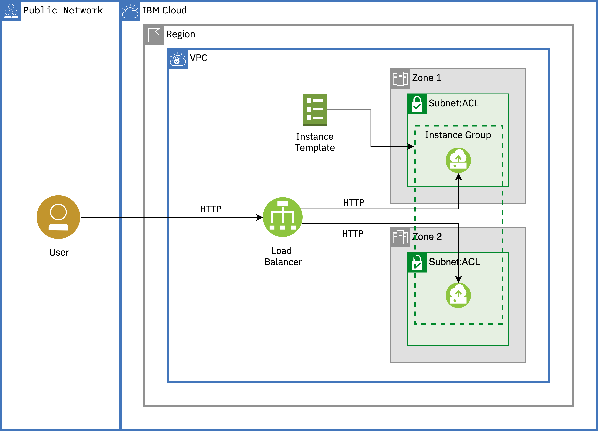
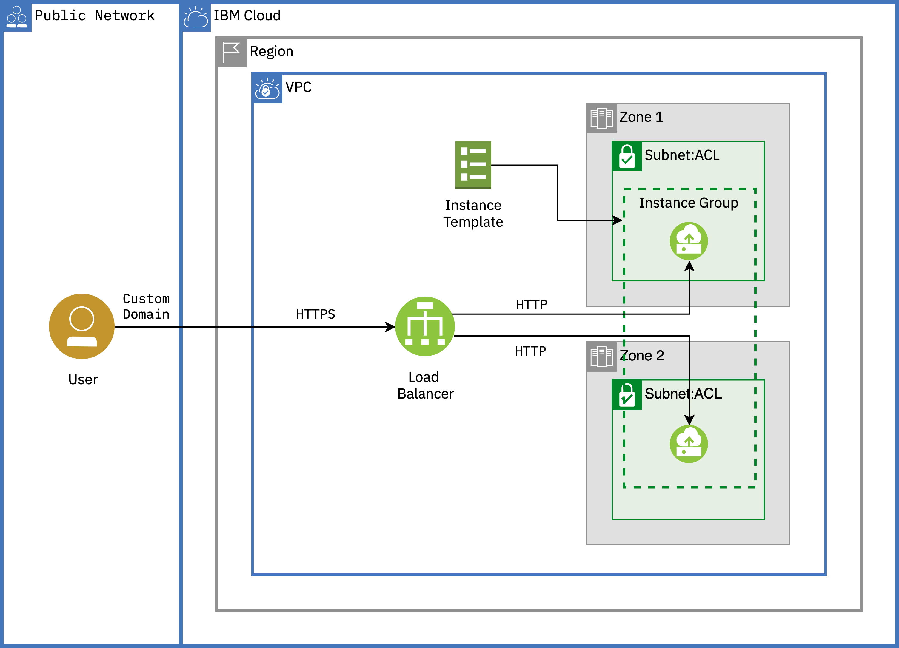

# Auto scale for VPC

With Auto Scale for VPC you can create an instance group to scale according to your requirements. Based on the target utilization metrics that you define, the instance group can dynamically add or remove instances to achieve your specified instance availability.

Following the instructions and executing the scripts, you will provision

- VPC
- Subnets - one in each zone (zone 1 and zone 2)
- VSI - one VSI in subnet-zone-1 to start with
- Load balancer (backend pool and frontend listener)
- Instance group using an instance template



### Pre-requisites:

- IBM Cloud IAM API key - refer [IAM documentation](https://cloud.ibm.com/docs/iam?topic=iam-manapikey)
- SSH key - refer [VPC SSH documentation](https://cloud.ibm.com/docs/vpc?topic=vpc-ssh-keys)
- If you want to enable **SSH offloading (termination)** or **End-to-end encryption**, you need to create a Certificate manager service, order a certificate and pass that to load balancer HTTPS listener, Follow the [instructions here](https://cloud.ibm.com/docs/certificate-manager?topic=certificate-manager-ordering-certificates) to learn the certificate ordering process.

### Getting started:

1. Copy the Terraform variables template
   ```sh
   cp terraform.tfvars.template terraform.tfvars
   ```
2. Update the values in `terraform.tfvars` file based on your requirement and save the file. To understand the variables, refer `variables.tf` file.
3. Initialize the Terraform providers. Run:
   ```sh
   terraform init
   ```
4. Execute terraform plan :
   ```sh
   terraform plan
   ```
5. Apply terraform plan:
   ```sh
   terraform apply
   ```

### SSL offloading (termination)

For all incoming HTTPS connections, the load balancer service terminates the SSL connection and establishes a plain-text HTTP communication with the back-end server. CPU-intensive SSL handshakes and encryption/decryption tasks are shifted away from the back-end servers, allowing them to use all their CPU cycles for processing application traffic.

   

### End-to-end encryption

In this section, you will enable end-to-end encryption by creating a self-signed certificate in the VSI.You will use the [SSL installation script - install-software-ssl.sh](scripts/install-software-ssl.sh)

   

### Clean-up

```sh
terraform destroy
```