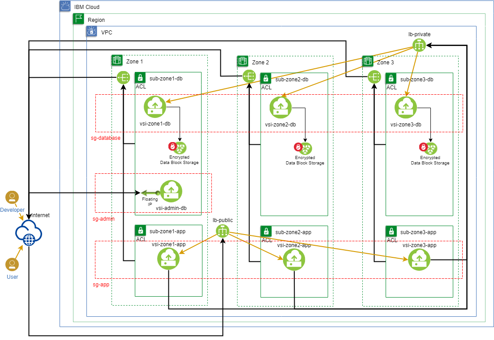
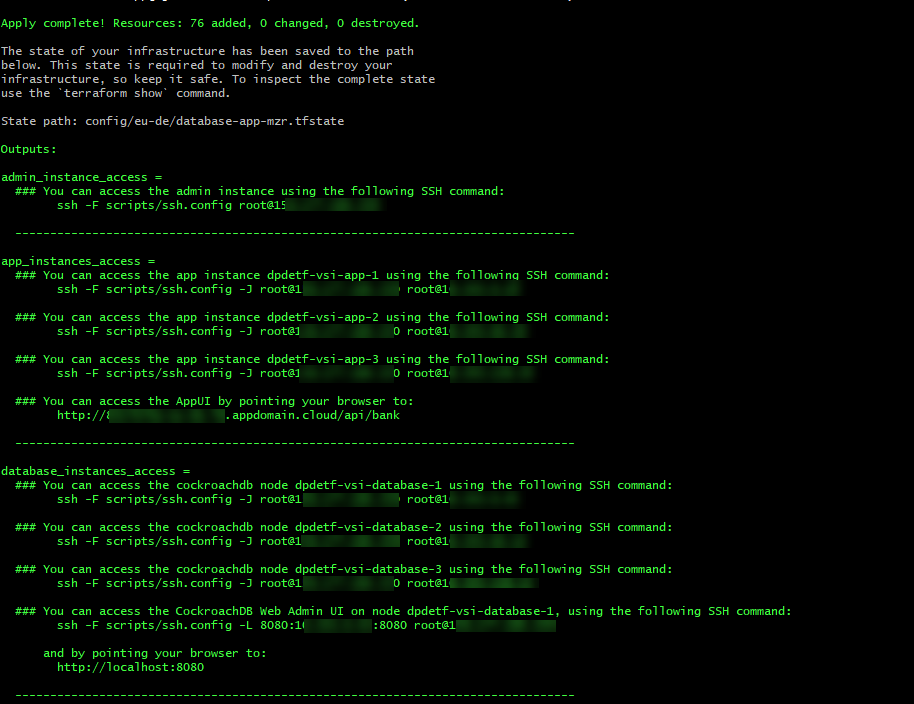
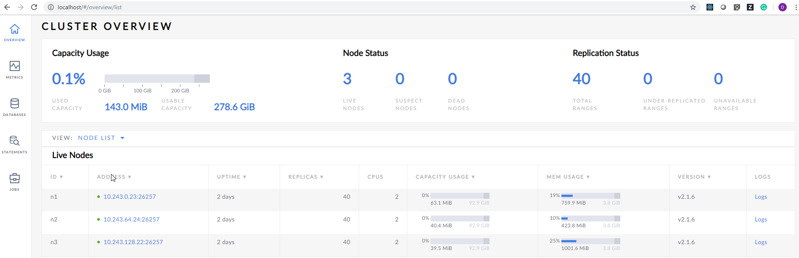
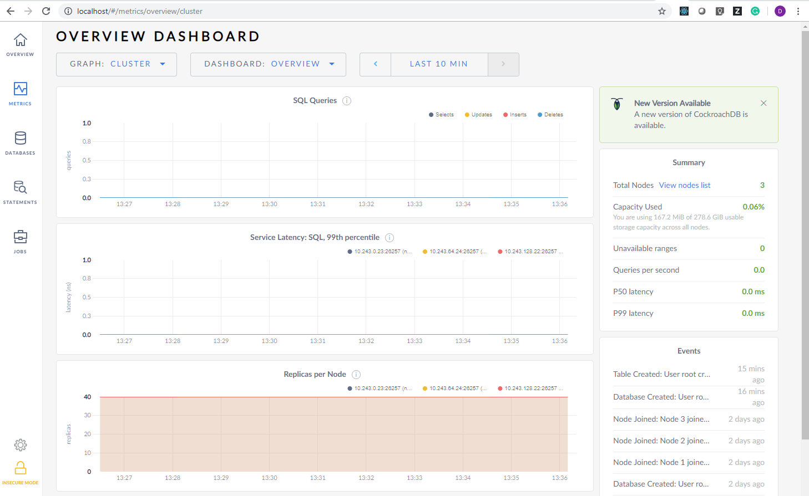

## Objectives
Blog post showing how to run CockroachDB in a VPC, on VSI with block storage and "bring your own encryption" key stored in Key Protect

Highlighting:

- Use of block storage for data application
- Encryption of data and application
- Use of cloud-init https://cloud.ibm.com/docs/vsi-is?topic=virtual-servers-is-user-data#user-data for the software installation?

## Deploying CockroachDB in a Multi-Zoned Environment with Encrypted Block Storage

Deploying a database for a web application with high availability, i.e. always online and security is considered by some to be a nontrivial activity, and one that a developer will almost always delegate to an administrator.  But it is not as time-consuming as one might think (once you understand all the components that are needed) and with the availability of virtual private cloud (VPC) and the various services it provides, i.e. load balancer as a service (LBaaS), block storage with encryption, security groups and more, a developer can quickly deploy a production like infrastructure, i.e. minus the CPU, RAM and/or storage to support a reduced workload.  

This post will explore some of these concepts and demonstrate how you can deploy a database such as CockroachDB in the IBM Cloud with high availability and security in mind.  With such an environment deployed, during the development of an application, the developer can test various failure scenarios and how their application reacts to those, i.e. loss of one or two nodes in the CockroachDB cluster, total loss of a VSI with block storage intact and recreating the VSI, etc...

## Environment Overview
A high availability environment can typically include as little as 2 nodes in a cluster. However, in this scenario we will be using CockroachDb as our database server and we will follow the [CockroachDB recommendation for a 3 nodes cluster](https://www.cockroachlabs.com/docs/stable/recommended-production-settings.html#basic-topology-recommendations) for a multi-active availability database environment. Such environment can be deployed in any of the multi-zones regions in the IBM Cloud and the 3 nodes distributed to each of the 3 zones in the given region.



| VPC 	| Zones 	| Subnets       	| VSIs            	| Volumes 	| Description                                                                 	|
|-----	|-------	|---------------	|-----------------	|---------	|-----------------------------------------------------------------------------	|
| vpc 	|       	|               	|                 	|         	|                                                                             	|
|     	| zone1 	|               	|                 	|         	| availability zone within region                                        	|
|     	|       	| sub&#x2011;database&#x2011;1  	|                 	|         	| subnet for database instances                                           	|
|     	|       	|               	| vsi&#x2011;database&#x2011;1    	|         	| virtual server instance running Ubuntu 18.04 LTS and CockroachDB        	|
|     	|       	|               	|                 	| boot    	| default created with every instance, provider encrypted                 	|
|     	|       	|               	|                 	| data    	| added to instance with 10 IOPS/GB Tier, customer encrypted                 	|
|     	|       	|               	| vsi-admin 	|         	| virtual server instance running Ubuntu 18.04 LTS and CockroachDB        	|
|     	|       	|               	|                 	| boot    	| default created with every instance, provider encrypted                 	|
|     	|       	| sub-app-1 	|                 	|         	| subnet for application instances                                        	|
|     	|       	|               	| vsi-app-1   	|         	| virtual server instance running Ubuntu 18.04 LTS and custom application 	|
|     	|       	|               	|                 	| boot    	| default created with every instance, provider encrypted                 	|
|     	| zone2 	|               	|                 	|         	| availability zone within region                                        	|
|     	|       	| sub-database-2  	|                 	|         	| subnet for database instances                                           	|
|     	|       	|               	| vsi-database-2    	|         	| virtual server instance running Ubuntu 18.04 LTS and CockroachDB        	|
|     	|       	|               	|                 	| boot    	| default created with every instance, provider encrypted                 	|
|     	|       	|               	|                 	| data    	| added to instance with 10 IOPS/GB Tier, customer encrypted                 	|
|     	|       	| sub-app-2 	|                 	|         	| subnet for application instances                                        	|
|     	|       	|               	| vsi-app-2   	|         	| virtual server instance running Ubuntu 18.04 LTS and custom application 	|
|     	|       	|               	|                 	| boot    	| default created with every instance, provider encrypted                 	|
|     	| zone3 	|               	|                 	|         	| availability zone within region                                        	|
|     	|       	| sub-database-3  	|                 	|         	| subnet for database instances                                           	|
|     	|       	|               	| vsi-database-3    	|         	| virtual server instance running Ubuntu 18.04 LTS and CockroachDB        	|
|     	|       	|               	|                 	| boot    	| default created with every instance, provider encrypted                 	|
|     	|       	|               	|                 	| data    	| added to instance with 10 IOPS/GB Tier, customer encrypted                 	|
|     	|       	| sub-app-3 	|                 	|         	| subnet for application instances                                        	|
|     	|       	|               	| vsi-app-3   	|         	| virtual server instance running Ubuntu 18.04 LTS and custom application 	|
|     	|       	|               	|                 	| boot    	| default created with every instance, provider encrypted                 	|

>**Note 1:** Load Balancers (LBaaS) and Public Gateways (PGW) are available across region with redundancy and auto-scale based on load and are IBM Cloud managed.

>**Note 2:** PGW are for outbound Internet access only, no inbound allowed unless it is a response to outbound request.

>**Note 3:** The data volumes are not shared as the database engine will handle data replication between the nodes. If the application requires it they can be shared.

>**Note 4:** The load balancers to the database instances have an internal only egress and will not accept any connections outside of the VPC.

>**Note 5:** The load balancer to the application instances are public and have an external egress, customer can also use their own address if desired.

## Components to be deployed
[VPC Components Glossary](https://cloud.ibm.com/docs/infrastructure/vpc?topic=vpc-vpc-glossary)

#### VPC
A virtual network tied to an account. It provides fine-grained control over virtual infrastructure and network traffic segmentation, along with security and the ability to scale dynamically.
[About VPC](https://cloud.ibm.com/docs/infrastructure/vpc-network?topic=vpc-network-about-networking-for-vpc)

#### Subnet
A subnet is an IP address range, bound to a single Zone, which cannot span multiple Zones or Regions. A subnet can span the entirety of a zone in an IBM Cloud VPC.
Virtual server instances (VSIs) are assigned an IP address within the subnet that you require.
[About Subnets](https://cloud.ibm.com/docs/infrastructure/vpc-network?topic=vpc-network-working-with-ip-address-ranges-address-prefixes-regions-and-subnets#ibm-cloud-vpc-and-subnets)

#### Security Group
A security group acts as a virtual firewall that controls the **inbound and outbound** traffic for one or more servers (VSIs). A security group is a collection of rules that specify whether to allow traffic for an associated VSI
[About Security Groups](https://cloud.ibm.com/docs/infrastructure/vpc-network?topic=vpc-network-using-security-groups)

#### Public Gateway
A Public Gateway (PGW) enables **outbound-only** access for a subnet (with all the VSIs attached to the subnet) to connect to the internet. Note that subnets are private by default; however, optionally, you can create a PGW and attach a subnet to the PGW. After a subnet is attached to the PGW, all the VSIs in that subnet can connect to the internet.
[About Public Gateways](https://cloud.ibm.com/docs/infrastructure/vpc-network?topic=vpc-network-about-networking-for-vpc#use-a-public-gateway)

#### Regions and Zone
A Region is a geographic area within which a VPC is deployed. Each region contains multiple zones, which represent independent fault domains. IBM Cloud VPC spans multiple zones within its assigned region.

A Zone is an independent fault domain. A Zone is an abstraction designed to assist with improved fault tolerance(it is extremely unlikely for two zones in a region to fail simultaneously) and decreased latency(less than 2ms in latency).

#### Virtual Server(Compute) Instances (VSIs)
A compute instance running the operating system of your choice along with the database and/or application

#### Block Storage
Persistent high-performance block storage volumes for your virtual server instances (VSIs) all backed by SSD. Block Storage for VPC provides primary boot volumes and secondary data volumes. Boot volumes are automatically created and attached during VSI provisioning. Data volumes can be created and attached during VSI provisioning as well. To protect your data, you can use your own encryption key or choose IBM-managed encryption for each the boot and data volume(s).
[About Block Storage for VPC](https://cloud.ibm.com/docs/infrastructure/block-storage-is?topic=block-storage-is-block-storage-about&topicid=block-storage-is-block-storage-about)

## Key protect instance
The VSIs that will be created for CockroachDB will each have a data block storage added. This block storage is by default encrypted with a cloud provided key, however customers can create or specify their own keys if they leverage the Key Protect service.

The script will generate a Key Protect instance and create a key that will be used to encrypt the block storage. 

## Build the environment in the IBM Cloud using a prepared shell script and template configuration

- Review the [behind the scenes](https://github.ibm.com/dimitri-prosper/snowball#behind-the-scenes) to understand what the build script can do.

    - The following provided configuration template [cockroachdb-template.json](./vpc-cockroachdb-mzr.template.json) will create all the resources in the [Environment Overview](#environment-overview) section and install/configure cockroachDB on the database VSI.

    - Supporting scripts are also available that run on targeted VSI.

        #### cloud-init scripts

        |   Name	|   Description	|
        |---	|---	|
        |   `cockroachdb.sh`	|   Creates the block storage partition, updates /etc/fstab and mounts it. Installs and configures each node in the CockroachDB cluster to run as a service (systemd) and and sets up the ntp service (typically required for database clusters to have a time service running on the nodes).	|
        |   `cockroachdb-admin.sh`	|   Initialize the cockroachdb cluster for the very first time.	|

        #### ssh-init scripts

        |   Name	|   Description	|
        |---	|---	|
        |   `cockroachdb.sh`	|   Configure cockroachdb. 	|
        |   `deployapp.sh`	|   Installs nodejs and deploys a small app to interact with a backend database service.	|
            
- Create a configuration file to match your desired settings and place in a directory of your choice, the following properties must be set: 

    `resources_prefix`: a value that will be used when naming resources it is added to the value of the name properties with a -.

    `region`:  name of the region to create the resources.

    `resource_group`: name of your resource group you will be creating the resources under (must exist prior to usage).
    
    `ssh_keys`: Your existing ssh key(s) name for in region access to VSIs after creation

    Example version: 

    ```json
    {
    "resources_prefix": "cockroach",
    "region": "eu-de",
    "resource_group": "default",
    "ssh_keys": [
        {
        "name": "ssh-cockroach",
        "type": "vpc"
        }
    ]
    }
    ```

- run the script
```
./build.sh --template=vpc-cockroachdb-mzr/vpc-cockroachdb-mzr.template.json --config=<your_config_file>.json
```

>NOTE
> 
> - Every time the script runs it creates a new file that contains all state information and the file is based on the name of the config file you provided and stored in the same directory, i.e. if --config=myconfig.json a new file is created called myconfig.state.json in the same directory.
>
> - If any errors are encountered during the script execution, you can run the script again, it will skip resources already created and pick up where it left off.
>
> - create a log file by adding the `--createLogFile` parameter to the above command.
>
> - add shell trace and IBMCLOUD_TRACE=true by adding the `--trace`  parameter to the above command.
 

- Review the results of running the script and connect to the instances created (IP addresses and hostnames in the screen shot are examples only and will be different for you.)

    


## Test the cluster (taken from the CockroachDB documentation)

1.	SSH into the admin instance.
    
    admin instance
    ```
    ssh -F vpc-cockroachdb-mzr/ssh-init/ssh.config root@<admin_instance_ip>
    ```

2.  Using the internal IP address of node 1, issue the following command:
    ```
    $ cockroach sql --insecure --host=<IP address node>
    ```

3.  Run some basic [CockroachDB SQL statements](learn-cockroachdb-sql.html):

    ```sql
    > CREATE USER IF NOT EXISTS maxroach;
    ```

    ```sql
    > CREATE DATABASE bank;
    ```

    ```sql
    > GRANT ALL ON DATABASE bank TO maxroach;
    ```

    ```sql
    > CREATE TABLE bank.accounts (id UUID PRIMARY KEY DEFAULT gen_random_uuid(), transactiontime TIMESTAMPTZ DEFAULT current_timestamp(),  balance DECIMAL);
    ```

    ```sql
    > INSERT INTO bank.accounts (balance) VALUES (1000.50);
    ```

    ```sql
    > SELECT * FROM bank.accounts;
    ```

    ```
    +----+---------+
    | id | balance |
    +----+---------+
    |  e915b462-f415-4b67-bd0d-fd22a68a62a5 |  1000.5 |
    +----+---------+
    (1 row)
    ```

4.  Exit the SQL shell on node 1:

    ```sql
    > \q
    ```

5.  Then connect the SQL shell to node 2, this time specifying the node's non-default port:

    ```shell
    $ cockroach sql --insecure --host=<IP address node>
    ```

6. Now run the same `SELECT` query:

    ```sql
    > SELECT * FROM bank.accounts;
    ```

    ```
    +----+---------+
    | id | balance |
    +----+---------+
    |  e915b462-f415-4b67-bd0d-fd22a68a62a5 |  1000.5 |
    +----+---------+
    (1 row)
    ```

    ```sql
    > INSERT INTO bank.accounts (balance) VALUES (100.75);
    ```

7. Exit the SQL shell on node 2:

    ```sql
    > \q
    ```

8. Repeat the same steps used for node 2 above for node 3, but change the insert to the one below:

    ```sql
    > INSERT INTO bank.accounts (balance) VALUES (50.00);
    ```

## Try a small application

1.	SSH into the app Virtual Server Instance(s) and start the NodeJS sample app.

2.  Open your browser and navigate the to the public load balancer address: http://<public_lb>/api/bank.

3.	Copy and paste the following queries:
  
```graphql
query read {
    read{
    id
    balance
    transactiontime
    }
}

mutation add {
    add(balance:"220"){
    rowCount
    }
}
```

4.	Execute a few read(s) and an add(s) while changing the value for the balance to validate entries are added. 

## Monitor the cluster

1. Configure a web proxy to admin server
    ```
    ssh -L 80:<address of any node>:8080 root@<floaring_ip>
    ```
2. Access the Admin UI for your cluster by pointing a browser to `http://localhost`. 

    

    Then click **Metrics** on the left-hand navigation bar.

    As mentioned earlier, CockroachDB automatically replicates your data behind-the-scenes. To verify that data written in the previous step was replicated successfully, scroll down to the **Replicas per Node** graph and hover over the line:

    
    
    The replica count on each node is identical, indicating that all data in the cluster was replicated 3 times (the default).

## Delete all resources

Running the following script will delete all resources listed inside of the <your_config_file>.json specified by the --config parameter.  Please note it will also delete the Key Protect store and encryption keys.

```
./delete.sh --template=vpc-cockroachdb-mzr/vpc-cockroachdb-mzr.template.json --config=<your_config_file>.json
```

>NOTE
> 
> - If any errors are encountered during the script execution, you can run the script again, it will skip resources already created and pick up where it left off.
>
> - create a log file by adding the `--createLogFile` parameter to the above command.
>
> - add shell trace and IBMCLOUD_TRACE=true by adding the `--trace`  parameter to the above command.
 
## Reference our tutorials

- Leverage the following tutorials to build the resources as depicted in the diagram under the [Environment Overview](#environment-overview) section. 
    - [Private and public subnets in a Virtual Private Cloud](https://cloud.ibm.com/docs/tutorials?topic=solution-tutorials-vpc-public-app-private-backend)

    - [Deploy isolated workloads across multiple locations and zones](https://cloud.ibm.com/docs/tutorials?topic=solution-tutorials-vpc-multi-region)

    - [Creating block storage volumes in IBM Cloud console](https://cloud.ibm.com/docs/infrastructure/block-storage-is?topic=block-storage-is-creating-block-storage&topicid=block-storage-is-block-storage-getting-started)

    - [Securely access remote instances with a bastion host](https://cloud.ibm.com/docs/tutorials?topic=solution-tutorials-vpc-secure-management-bastion-server)

    - [Deploy CockroachDB](https://www.cockroachlabs.com/docs/stable/deploy-cockroachdb-on-premises-insecure.html#systemd) leveraging the documentation from CockroachDB for on-premises deployment. One difference is we will us the load balancer provided in the IBM Cloud VPC rather than installing the HA Proxy. 

## TODO ITEMS
>- need to be more clear if any of this is for production for development
>
>- need to explain it is more test environment before going production
>
>- remove the table repetition for the zone (simplify)
>
>- introduction to VPC would be warranted (isolating resources, security) needed for developer wanting near production 
>
>- simplify the diagram
>
>- elaborate more on the security concepts
>
>- TLS for database could be nice to have....