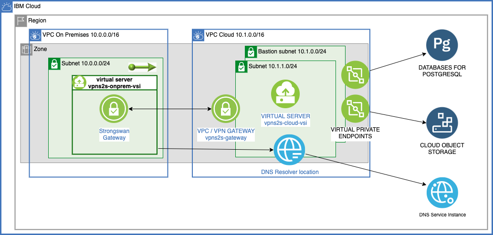

# Use a VPC/VPN gateway for secure and private on-premises access to cloud resources

Refer to [the associated solution tutorial](https://cloud.ibm.com/docs/solution-tutorials?topic=solution-tutorials-vpc-site2site-vpn#create-vpc) for complete instructions.

## TLDR;

{: class="center"}

```
cp template.local.env local.env
# edit local.env
source local.env
terraform init
terraform apply
terraform output environment_variables
# follow the instructions in the tutorial to test connectivity

# Look at the rest of this file for more stuff to do.
# When your are done:
terraform destroy
```

## Troubleshoot
If the tutorial worked without problems all is good. If not here are some things to look into:

Print the environment_variables. Copy/paste them into your shell:

``` sh
terraform output environment_variables
```

They should look something like this:

``` sh
#-----------------------------------
# Variables from the cloud resources created
#-----------------------------------
IP_FIP_ONPREM=169.48.154.224
IP_PRIVATE_ONPREM=10.0.0.4
IP_PRIVATE_CLOUD=10.1.1.4
IP_FIP_BASTION=52.118.190.142
IP_PRIVATE_BASTION=10.1.0.4
IP_DNS_SERVER_0=10.1.0.5
IP_DNS_SERVER_1=10.1.1.6
IP_ENDPOINT_GATEWAY_POSTGRESQL=10.1.1.9
IP_ENDPOINT_GATEWAY_COS=10.1.1.5
HOSTNAME_POSTGRESQL=a43ddb63-dcb1-430a-a2e4-5d87a0dd12a6.6131b73286f34215871dfad7254b4f7d.private.databases.appdomain.cloud
HOSTNAME_COS=s3.direct.us-south.cloud-object-storage.appdomain.cloud
PORT_POSTGRESQL=32525
```

The user_data/onprem.sh script is executed by cloud-init, verify it worked correctly

``` sh
ssh root@$IP_FIP_ONPREM
<copy/paste variables from terraform output environment_variables>
```

Verify the cloud-init logs:
``` sh
# the last part of the log file is the execution of the user_data script, look for stuff something like this:
#+ echo onprem.sh
#onprem.sh
#+ ONPREM_CIDR=10.0.0.0/16
#+ GW_CLOUD_IP=CHECK
#+ PRESHARED_KEY=20_PRESHARED_KEY_KEEP_SECRET_19
#+ CLOUD_CIDR=10.1.0.0/16
#+ DNS_SERVER_IP0=CHECK
#+ DNS_SERVER_IP1=CHECK
#+ main
vi /var/log/cloud-init-output.log
```


Verify these files match what was written with onprem.sh:
``` sh
vi /etc/sysctl.conf
vi /etc/ipsec.secrets
vi /etc/ipsec.conf
```

Verify netplan, should look something like this:
``` sh
#network:
#  ethernets:
#    ens3:
#      dhcp4: true
#      dhcp4-overrides:
#        use-dns: false
#      match:
#        macaddress: 02:00:16:3e:fa:c3
#      nameservers:
#        addresses:
#        - 10.1.0.5
#        - 10.1.1.5
#      set-name: ens3
#  version: 2

vi /etc/netplan/50-cloud-init.yaml
```

Verify that the DNS servers
``` sh
echo $IP_DNS_SERVER_0
echo $IP_DNS_SERVER_1
systemd-resolve --status
```

The ping is not going to be successful but notice the IP address displayed, expect the 10. address returned by dig:
``` sh
ping $HOSTNAME_POSTGRESQL
```

If the IP address of postgresql is not correct, try clearing the dns caches, then wait a minute and try again
``` sh
systemd-resolve --flush-caches
```

The cloud-init user_data script should have upgraded netplan.io to the latest and executed: netplan apply.
verify that these commands are in the log:
``` sh
vi /var/log/cloud-init-output.log
```
## Deploy an app

Instructions to deploy an app are not in the tutorial. Generate the application_variables along with the environment_variables above.  Copy/paste them into your shell:

``` sh
terraform output application_variables
```

They should look something like this:

``` sh
RESOURCE_GROUP_NAME=smart
REGION=us-south
GUID_POSTGRESQL=674f87fa-c9fe-4345-b97b-f385268a9265
GUID_COS=3990b164-0f3a-4802-9e65-cb021dc5ba97
POSTGRESQL_CLI="PGPASSWORD=0123456789012fd0610ae28d8c29cb096c308f1fc04ad3cdc89e02ab7baaacbc1 PGSSLROOTCERT=01234567890129-11e9-a1c2-52b4b41c25ad psql 'host=a43ddb63-dcb1-430a-a2e4-5d87a0dd12a6.6131b73286f34215871dfad7254b4f7d.private.databases.appdomain.cloud port=32525 dbname=ibmclouddb user=ibm_cloud_674f87fa_c9fe_4345_b97b_f385268a9265 sslmode=verify-full'"
```

Target the region and resource group:
```sh
ibmcloud target -g $RESOURCE_GROUP_NAME -r $REGION
```

Make .../vpc-tutorials/sampleapps/nodejs-graphql the current directory on your desktop
```sh
cd ../sampleapps/nodejs-graphql
# verify you are in the .../vpc-tutorials/sampleapps/nodejs-graphql directory
pwd
```

Configure the microservice by adding credentials and certificates:
```sh
ibmcloud resource service-key $GUID_POSTGRESQL --output json > config/pg_credentials.json
ibmcloud resource service-key $GUID_COS --output json > config/cos_credentials.json
```

Create postgresql certificates:
```sh
ibmcloud cdb deployment-cacert $CRN_POSTGRESQL -e private -c . -s
```

Copy the application to the cloud and on-premises VSIs
```sh
scp -J root@$IP_FIP_BASTION -r ../nodejs-graphql root@$IP_PRIVATE_CLOUD:
scp -r ../nodejs-graphql root@$IP_FIP_ONPREM:
```

Run microservice on the cloud VSI
```sh
ssh -J root@$IP_FIP_BASTION root@$IP_PRIVATE_CLOUD
cd nodejs-graphql
npm install
npm run build
# copy and optionally touch up a little (not required)
cp config/config.template.json config/config.json
node ./build/createTables.js
node ./build/createBucket.js
# notice the unique bucket name
vi config/config.json; # change the bucketName
# start the application
npm start
```

Test the microservice from the on-premises VSI (over the VPN), on a different terminal:
```sh
ssh root@$IP_FIP_ONPREM
<copy/paste variables>
# exect empty array from postgresql
curl -X POST -H "Content-Type: application/json" --data '{ "query": "query read_database { read_database { id balance transactiontime } }" }' http://$IP_PRIVATE_CLOUD/api/bank
# expect empty array from object storage
curl -X POST -H "Content-Type: application/json" --data '{ "query": "query read_items { read_items { key size modified } }" }' http://$IP_PRIVATE_CLOUD/api/bank
# add a record to postgresql and object storage
curl -X POST -H "Content-Type: application/json" --data '{ "query": "mutation add_to_database_and_storage_bucket { add(balance: 10, item_content: \"Payment for movie, popcorn and drink...\") { id status } }" }' http://$IP_PRIVATE_CLOUD/api/bank
# read the records in postgresql and object storage
curl -X POST -H "Content-Type: application/json" --data '{ "query": "query read_database_and_items { read_database { id balance transactiontime } read_items { key size modified } }" }' http://$IP_PRIVATE_CLOUD/api/bank

# test access to postgresql over the private endpoint gateway
cd ~/nodejs-graphql
eval $POSTGRESQL
<control><d>
exit
```

### Remove the resources

   ```
   terraform destroy
   ```