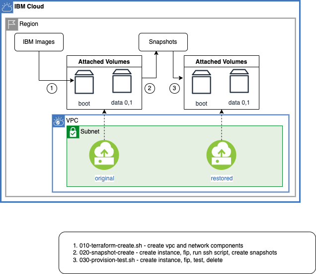

# Automate the Creation of Boot Snapshots

## Overview

Companion terraform and scripts for blog post [Automate the Backup and Restore of Cloud Instances with Snapshots](https://www.ibm.com/cloud/blog/automate-the-backup-and-restore-of-cloud-instances-with-snapshots)



## Prerequisites

Permissions:
> The scripts do not check permissions. You must ensure you have the right permissions:
> - to create VPC, subnets, instances
> - to create snapshots

All of the operations will be done in a bash shell and making use of terraform and ibmcloud command. You will find instructions to download and install these tools for your operating environment in the [Getting started with tutorials guide](https://cloud.ibm.com/docs/solution-tutorials?topic=solution-tutorials-tutorials)

To avoid the installation of these tools you can use the [Cloud Shell](https://cloud.ibm.com/shell) from the IBM Cloud console. 

ssh
> Some of the scripts will ssh into the newly created instances. It is OK to ignore the ssh failures - you just miss out on the ability to test.  It is best to intialize your private ssh key by making it available in ~/.ssh/id_rsa and must be read only.  This was mine::

```
pquiring@cloudshell:~$ ls -l ~/.ssh
total 8
-r-------- 1 pquiring user 3243 Jun 10 18:23 id_rsa
```

terraform version

> Below, if the terraform version prerequisite check fails try: `cd terraform; tfswitch; cd ..`
> The tfswitch command will find a new copy of terraform to install.


## Create and Test a snapshot
1. git the code and cd into this directory:

   ```sh
   git clone https://github.com/IBM-Cloud/vpc-tutorials
   cd vpc-tutorials/vpc-snapshot
   ```

1. Copy the configuration file and set the values to match your environment.

   ```sh
   cp template.local.env local.env
   ```
   Use your editor I use:
   ```sh
   vi local.env
   ```

1. Load the values into the current shell.

   ```sh
   source local.env
   ```

1. Ensure you have the prerequisites to run the scripts.  Read the output carefully

   ```sh
   ./000-prereqs.sh; # see Prerequisite section above to resolve problems
   ```
1. Run all the scripts.  Expect them all to end with: >>> success
   ```sh
   ./000-prereqs.sh
   ./010-terraform-create.sh; # requires ssh to wait for cloud-init to finish, otherwise wait for a while
   ./020-snapshot-backup.sh
   ./030-snapshot-restore.sh
   ./040-snapshot-test.sh; # requires ssh to execute the tests on the restored instance
   ```
1. Explore.  You can ssh into both the original and restored instance.  Take a look at /etc/fstab and run commands like mount, df, ...  See the blog post for more details.  Navigate to the [Virtual private cloud](https://cloud.ibm.com/vpc-ext/overview) section of the [IBM Cloud console](https://cloud.ibm.com/) and take a look at the Virtual server instances and asociated volumes and snapshots.

## Cleanup

   ```sh
   ./080-snapshot-cleanup.sh
   ./090-terraform-destroy.sh
   ```
